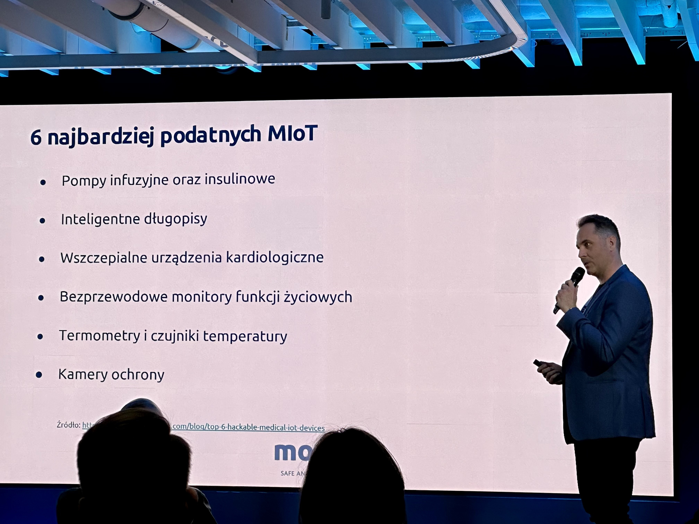
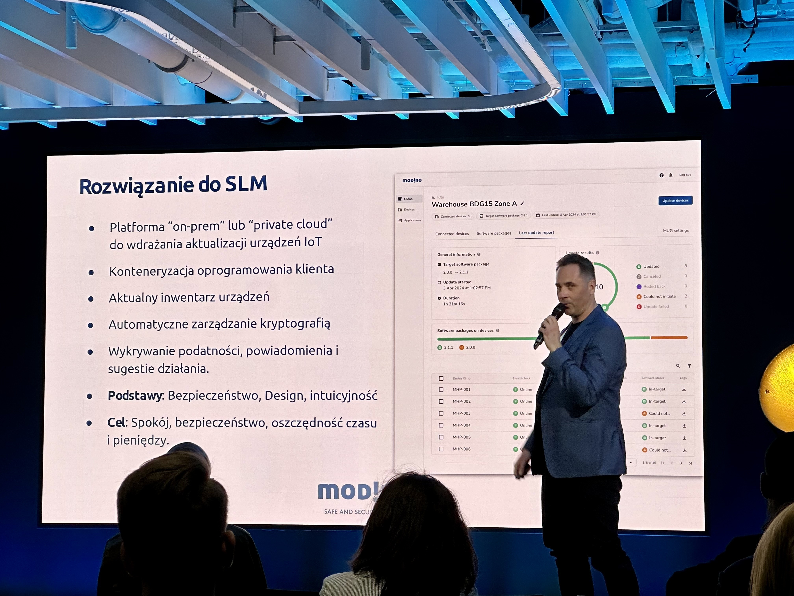

The recent MEDmeetsTECH conference provided a comprehensive overview of the role of technologies like artificial intelligence or Internet-of-things in modern medicine. Modino.io with its CEO Błażej Pawlak on the stage delivered a compelling presentation that shed light on various critical aspects of IoT in healthcare, from terminologies to security measures and upcoming regulations.

## Terminologies in Medical IoT

Our presentation began with clarifying the different terminologies used in the context of IoT in healthcare. Medical IoT (MIoT) refers to devices and systems specifically designed for medical purposes that connect our protein-based world with the digital domain. The Internet of Medical Things (IoMT) is a subset of IoT encompassing all connected medical devices and applications connected to healthcare IT systems via online computer networks. Furthermore, IoT–health is a broader term that includes all IoT applications related to health and wellness, benefiting healthcare organizations and healthcare professionals alike.

## Types of IoT Devices in Medicine

The presentation categorized IoT devices in healthcare into several groups:
- **Personal Wearables**: more common but still can be qualified as wearable devices in healthcare. Like fitness bands, smartwatches, smart rings, and smart glasses monitor health parameters such as heart rate, activity levels, and sleep patterns.
- **Personal Medical Devices**: These include inhalers, Holter monitors, glucose meters, prosthetics, and insulin pumps that provide essential health data and assist in managing chronic conditions.
- **Medical Equipment**: More advanced Healthcare IoT devices such as analyzers, vital signs monitors, defibrillators, MRI machines, ultrasound devices, medication dispensers, PACS servers, and DICOM workstations.
- **Technologically Advanced Devices**: Cutting-edge technology like the Vinci Surgical System, ZEUS Robotic Surgical System, and Neuralink.

## Recognized Problems with IoT in healthcare

Despite the benefits, Modino.io highlighted several challenges associated with IoT in healthcare industry including mobile devices in healthcare. One major concern is  security risks. The rapid increase in the number of devices has yet to be matched by improvements in security, making them vulnerable to cyber-attacks. Device management is another issue; the diversity of IoT devices makes it difficult to manage and update them, especially in large numbers. The cost and complexity of updates are also problematic, as updating numerous devices is often costly and time-consuming, leading to infrequent updates. Regulatory compliance adds another layer of complexity. Keeping up with regulations and integrating them into IoT devices is challenging because regulations demand high-quality products at reduced costs and prolonged support periods, typically around five years. Evolving software further complicates matters; IoT device software must continuously adapt to changing environmental conditions. While IoT allows for faster data access and a comprehensive view of patient health, the connection to the internet brings inherent risks. These challenges impact the entire healthcare sector, including healthcare facilities.

## Common Types of IoT Cyber-Attacks in Medicine

Modino.io detailed various types of cyber-attacks targeting IoT medical devices:
- **Ransomware**: Encrypts data, demanding a ransom for its release. Studies show that it may be fatal to patients as outlined by [wired.com](https://www.wired.com/story/ransomware-hospital-death-germany/).
- **Denial of Service (DoS)**: Overloads the device with traffic, rendering it unusable.
- **Firmware Hijacking**: Exploits the lack of signature and validation in firmware updates.
- **Multicast Attacks**: Create botnets that lead to Distributed Denial of Service (DDoS) attacks.
- **Targeted Attacks**: Specifically aimed at certain devices or systems.
- **Man-in-the-Middle Attacks**: Intercepts and analyzes data transmissions.
- **Eavesdropping**: Due to a lack of encryption and poor credential rotation practices, attackers can easily listen in on communications.
- **Automated Attacks**: Uses artificial intelligence to automate and enhance attack strategies.
- **Vulnerable Software**: Exploits software vulnerabilities and dependencies to gain unauthorized access.

## Attack Vectors in Medical IoT

Understanding attack vectors is crucial for enhancing security. Błażej emphasized that:
- 41% of attacks exploit weaknesses in device software.
- 75% of infusion pumps have unpatched security flaws.
- 83% of medical imaging systems run on unsupported operating systems.
- 98% of IoT device network traffic is unencrypted, making it easy for attackers to intercept.
- 57% of all IoT devices have medium to high-risk vulnerabilities.

Source: [ransomware.org](https://ransomware.org/blog/healthcare-industry-vulnerable-to-ransomware/)

## Most Vulnerable Medical IoT Devices

Several MIoT devices are more susceptible to cyber-attacks. These include infusion and insulin pumps, smart pens, implantable cardiac devices, wireless vital signs monitors, thermometers and temperature sensors, and security cameras.

## Ensuring Security in Medical IoT

To ensure medical IoT security, the CEO of Modino.io suggested multiple layers and measures. He recommended a layered security approach encompassing procedures, hardware, and software, involving risk analysis using methods like STRIDE and CVSS. Cryptography is essential in healthcare to ensure non-repudiation, integrity, confidentiality, and authentication. Lifecycle management, which involves managing both the Software Lifecycle (SLM) and the Product Lifecycle (PLM), is crucial. Security and privacy should be foundational elements, not add-ons. Vulnerability management is also vital; quickly identifying, patching, and securely delivering updates is essential. Analyzing Common Vulnerabilities and Exposures (CVE) is part of this process. Maintaining a Software Bill of Materials (SBOM) and a Cryptography Bill of Materials (CBOM) ensures an inventory of software components and cryptographic artifacts, respectively. Regular rotation of cryptographic keys and conducting external audits through penetration testing are also recommended. These measures are essential to protect healthcare technology and connected medical devices.

## Upcoming Regulations

The presentation was concluded by discussing several upcoming regulations aimed at tightening security standards for medical IoT devices.

<table style={{border: "1px solid black",borderCollapse:"collapse"}}>
  <thead>
    <tr>
      <th style={{border: "1px solid black", paddingInline: "2px"}}>Regulation Name</th>
      <th style={{border: "1px solid black", paddingInline: "2px"}}>Focus Area</th>
      <th style={{border: "1px solid black", paddingInline: "2px"}}>Effective Date</th>
    </tr>
  </thead>
  <tbody>
    <tr>
      <td style={{border: "1px solid black", paddingInline: "2px"}}>ISO 81001-5-1</td>
      <td style={{border: "1px solid black", paddingInline: "2px"}}>Security of medical software</td>
      <td style={{border: "1px solid black", paddingInline: "2px"}}>May 24, 2024</td>
    </tr>
    <tr>
      <td style={{border: "1px solid black", paddingInline: "2px"}}>EU Cyber Resilience Act</td>
      <td style={{border: "1px solid black", paddingInline: "2px"}}>Medical ecosystem including cloud services, software and servers</td>
      <td style={{border: "1px solid black", paddingInline: "2px"}}>March 12, 2024</td>
    </tr>
    <tr>
      <td style={{border: "1px solid black", paddingInline: "2px"}}>Radio Equipment Directive</td>
      <td style={{border: "1px solid black", paddingInline: "2px"}}>Devices using wireless networks</td>
      <td style={{border: "1px solid black", paddingInline: "2px"}}>August 1, 2024</td>
    </tr>
    <tr>
      <td style={{border: "1px solid black", paddingInline: "2px"}}>Network and Information Security Directive (NIS-2)</td>
      <td style={{border: "1px solid black", paddingInline: "2px"}}>Updates to security standarts, including those for Medical IoT</td>
      <td style={{border: "1px solid black", paddingInline: "2px"}}>January 16, 2023</td>
    </tr>
  </tbody>
</table>

## How Modino.io Can Help?
Modino.io offers several solutions to address these challenges effectively. First of all it is an on-prem or private cloud platform for seamless deployment of IoT device updates. The system leverages efficient software containerization that ensures robust and scalable client software management. Keeping a current device inventory helps maintain an up-to-date record of all connected devices. Automatic cryptography management enhances security by managing cryptographic keys and certificates automatically. Modino.io’s vulnerability detection and notification system identifies vulnerabilities, provides notifications, and suggests actionable steps. Modino.io emphasizes a strong foundation in security, user-friendly design, and intuitive interfaces, aiming to provide peace of mind, enhanced security, and significant savings in time and costs.

## Conclusion
The MEDmeetsTECH event, with Modino.io's in-depth presentation, highlighted the transformative potential of IoT in medicine and the critical need for robust security measures. Ensuring regular updates, compliance with regulations, and a proactive approach to security will be essential in maximizing the benefits of IoT in healthcare while mitigating associated risks. By focusing on the Internet of Things (IoT) within the healthcare sector, healthcare organizations can better manage connected medical devices and enhance overall healthcare technology.
